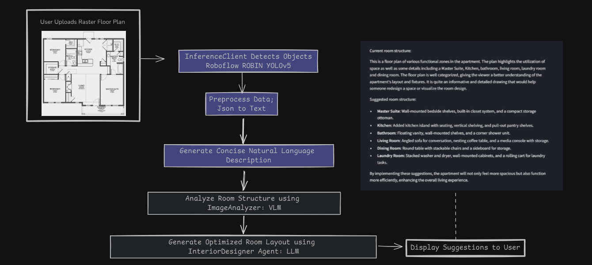

# RoomAligner

RoomAligner is an AI-powered interior design assistant that helps users optimize room layouts for better flow and space utilization. By analyzing floor plan images, RoomAligner provides intelligent suggestions on how to rearrange furniture, identify potential space optimizations, and improve room functionality. It leverages advanced AI models to understand room structures and offer personalized design insights.

## Features
- **Object Detection**: Automatically detects objects (furniture, fixtures, etc.) from room floor plan images.
- **Natural Language Descriptions**: Transforms room data into a detailed natural language description, highlighting key features and layout.
- **Space Optimization Suggestions**: Provides intelligent suggestions to optimize room layouts by improving the arrangement of furniture and utilizing unused space.
- **Interactive UI**: Upload your floor plan image, get instant insights, and view optimized room layouts directly through the app interface.

## How It Works
1. **Upload an Image**: Users can upload a floor plan or room image in `.jpg` format.
2. **AI-Powered Object Detection**: RoomAligner detects and classifies objects in the image using a powerful inference model.
3. **Natural Language Description**: The tool generates a descriptive breakdown of the room’s current structure, identifying key furniture pieces and functional zones.
4. **Space Optimization**: Based on the room structure, RoomAligner suggests ways to improve space utilization, rearranging furniture for better flow and proposing enhancements.



## Installation
### Clone the Repository
```bash
git clone https://github.com/your-username/roomaligner.git
cd roomaligner
```

### Install Dependencies
Use the provided `requirements.txt` file to install the necessary Python packages.
```bash
pip install -r requirements.txt
```

### Environment Variables
Create a `.env` file and add your API keys for Roboflow and OpenAI.
```plaintext
ROBOFLOW_API_KEY=your_roboflow_api_key
OPENAI_API_KEY=your_openai_api_key
```

### Run the App
```bash
streamlit run main.py
```

## Usage
1. Launch the app using Streamlit.
2. Upload an image of your room or floor plan.
3. View the detected objects and natural language description.
4. Get suggestions for improving your room layout with enhanced space optimization.

## Project Structure
- `raster/`: Contains the `InferenceClient` for detecting objects in the image.
- `plan/`: Includes the image analyzer and agent modules for generating descriptions and suggestions.
- `utils/`: Utility functions, including the data preprocessing pipeline.
- `main.py`: The main entry point for the Streamlit app.

## Developer Guide 

<details>
<summary>Click to expand the Developer Guide</summary>

#### **Overview**

Documentation for interacting with the **RoomAligner API**, which is hosted at [https://ashad001-roomaligner.hf.space](https://ashad001-roomaligner.hf.space). This API helps generate room structure suggestions based on uploaded images or URLs of room plans.

#### **Embedding the API**

For embedding the API in an application or webpage, you can use an iframe as follows:

```html
<iframe
  src="https://ashad001-roomaligner.hf.space"
  frameborder="0"
  width="850"
  height="450"
></iframe>
```

---

#### **Available Endpoints**

##### 1. **Upload Room Image (File) and Get Suggestions**

- **Endpoint**: `/upload-room-image/`
- **Method**: `POST`
- **Description**: This endpoint accepts an image of a room plan, processes it to classify objects, generates a natural language description, and provides suggestions for room structure improvement.

##### **Request Format**

- **URL**: `/upload-room-image/`
- **Method**: `POST`
- **Content-Type**: `multipart/form-data`
- **Parameters**:
  - `file`: The room plan image file (JPEG, PNG, or BMP format).

##### **Example Request (cURL)**

```bash
curl -X POST "https://ashad001-roomaligner.hf.space/upload-room-image/" \
  -H "accept: application/json" \
  -H "Content-Type: multipart/form-data" \
  -F "file=@/path/to/your/image.jpg"
```

##### **Response**

If the request is successful, the API returns a JSON response with:
- Natural language description of the room plan.
- The current room structure.
- Formatted room structure for better flow and space utilization.

##### **Example Response**

```json
{
  "natural_language_description": "The room contains a sofa, coffee table, and TV. The layout is suitable for a small living room.",
  "room_structure": "Current room layout includes the following furniture: Sofa (center), TV (front), Coffee Table (middle).",
  "formatted_room_structure": "We suggest moving the coffee table closer to the seating area and positioning the TV on the right wall to improve flow."
}
```

##### **Error Responses**

- **500 Internal Server Error**: If something goes wrong while processing the image or generating suggestions, the API will return an error message in JSON format.

```json
{
  "detail": "An error occurred: <error details>"
}
```

---

##### 2. **Upload Room Image (URL) and Get Suggestions**

- **Endpoint**: `/upload-room-image-url/`
- **Method**: `POST`
- **Description**: This endpoint accepts the URL of an image of a room plan, processes it, and provides suggestions for room structure improvement.

##### **Request Format**

- **URL**: `/upload-room-image-url/`
- **Method**: `POST`
- **Content-Type**: `application/x-www-form-urlencoded`
- **Parameters**:
  - `image_url`: The URL of the room plan image (JPEG, PNG, or BMP format).

##### **Example Request (cURL)**

```bash
curl -X POST "https://ashad001-roomaligner.hf.space/upload-room-image-url/" \
  -H "accept: application/json" \
  -d "image_url=https://example.com/path/to/room_image.jpg"
```

##### **Response**

Similar to the file upload endpoint, the API returns a JSON response with:
- Natural language description of the room plan.
- The current room structure.
- Formatted room structure for better flow and space utilization.

---

#### **Frontend Interaction Guide**

To interact with the API, follow these steps:

1. **File Upload**:
   - Use an `HTML <input>` element with `type="file"` to allow users to upload the image of the room.
   
   ```html
   <input type="file" id="roomImage" accept="image/jpeg,image/png,image/bmp">
   ```

2. **API Request**:
   - Use JavaScript's `FormData` to package the uploaded image.
   - Send a `POST` request to the `/upload-room-image/` endpoint using `fetch()` or any preferred HTTP client (e.g., Axios).

   **Example Using JavaScript's Fetch API**:

   ```javascript
   const uploadImage = async () => {
       const fileInput = document.getElementById('roomImage');
       const formData = new FormData();
       formData.append('file', fileInput.files[0]);

       try {
           const response = await fetch('https://ashad001-roomaligner.hf.space/upload-room-image/', {
               method: 'POST',
               body: formData
           });

           const result = await response.json();
           console.log('Natural Language Description:', result.natural_language_description);
           console.log('Current Room Structure:', result.room_structure);
           console.log('Formatted Room Structure:', result.formatted_room_structure);
       } catch (error) {
           console.error('Error uploading image:', error);
       }
   };
   ```

3. **URL Upload**:
   - You can also let users input an image URL and send it to the `/upload-room-image-url/` endpoint.

   **Example Using JavaScript's Fetch API**:

   ```javascript
   const uploadImageUrl = async () => {
       const imageUrl = document.getElementById('imageUrl').value;

       try {
           const response = await fetch('https://ashad001-roomaligner.hf.space/upload-room-image-url/', {
               method: 'POST',
               headers: {
                   'Content-Type': 'application/x-www-form-urlencoded',
               },
               body: `image_url=${encodeURIComponent(imageUrl)}`
           });

           const result = await response.json();
           console.log('Natural Language Description:', result.natural_language_description);
           console.log('Current Room Structure:', result.room_structure);
           console.log('Formatted Room Structure:', result.formatted_room_structure);
       } catch (error) {
           console.error('Error uploading image URL:', error);
       }
   };
   ```

4. **Handle the Response**:
   - Parse the JSON response and display the results on your webpage. You can show the natural language description, current room structure, and suggestions for improving the room layout.

---

#### **CORS Policy**

CORS is enabled on the API, allowing requests from any origin (`*`). Therefore, frontend applications can make cross-origin requests directly without additional configuration.

</details>


## Contact
For questions, feedback, or contributions, feel free to reach out to:
- **Ashad Abdullah** – [GitHub](https://github.com/Ashad001) | [LinkedIn](https://linkedin.com/in/ashadqureshi1/)
